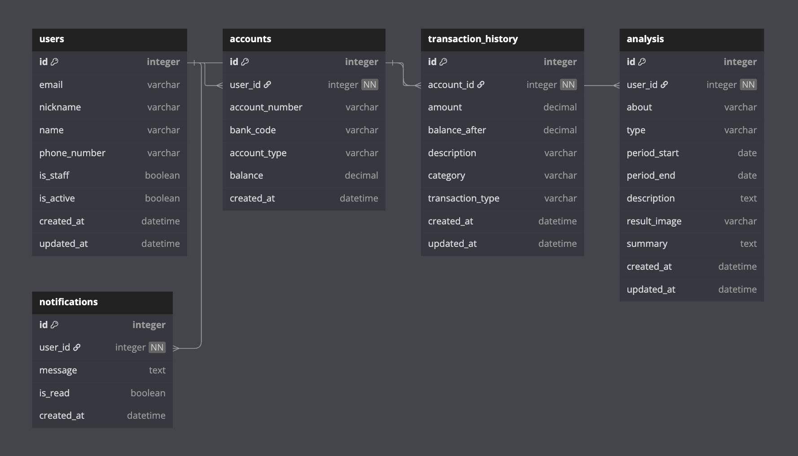
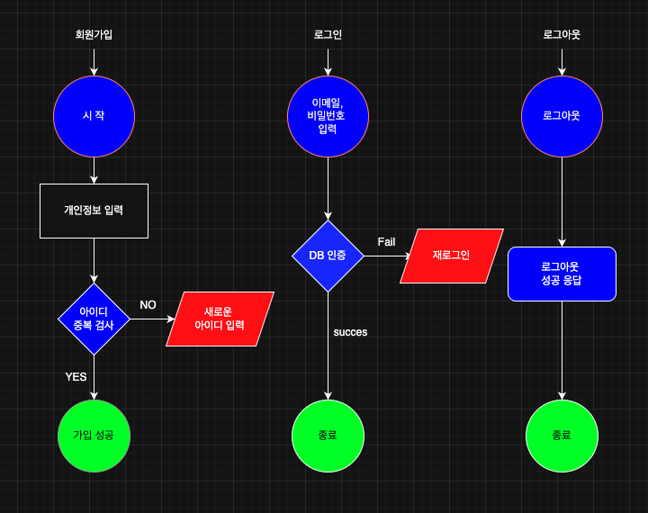

## user 테이블
- 사용자 계정을 저장하는 테이블입니다. 
로그인에 사용되는 이메일, 비밀번호 및 연락처 등의 정보를 포함합니다.
또한 관리자 / 스태프 여부 및 활성화 / 비활성화 여부도 포함되어 있습니다.

## account 테이블
- 사용자가 보유한 실제 계좌 정보를 저장하는 테이블입니다.
각 계좌는 특정 사용자와 연결되며, 은행 코드, 계좌 유형 및 잔액 등의 정보를 포함합니다.

## transaction_history 테이블
- 각 계좌의 거래 내역을 저장하는 테이블입니다.
거래 금액, 거래 후 잔액, 거래 내역 및 입출금 타입 등의 정보를 포함합니다.

```
users  ────────< accounts  ────────< transaction_history
(1)                (N)                      (N)
```



## 회원가입 / 로그인 / 로그아웃 로직 설명

### 회원가입(Sign Up)
1. 사용자가 이메일, 비밀번호 등 정보 입력
2. 서버는 유효성 검사 수행
3. 이메일 중복 여부 확인
4. 문제가 없으면 DB에 저장
5. 성공 메시지 반환

### 로그인(Login)
1. 사용자 입력 → 이메일 / 비밀번호 확인
2. 정보가 일치하면 JWT 토큰 발급
3. 클라이언트에 토큰 반환

### 로그아웃(Logout)
1. 클라이언트 측에서 토큰 삭제
2. (옵션) 서버에서 블랙리스트 처리
3. 성공 응답

